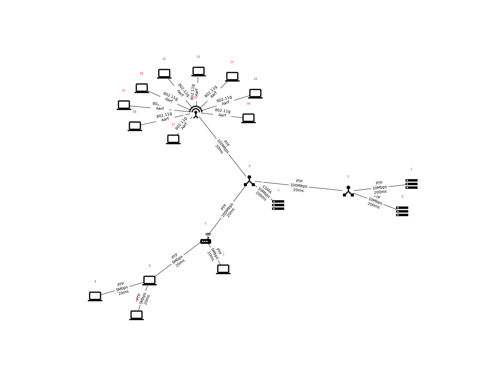

# ns3 homework

we had to implement this network topology with ns3 with an application layer defined in _2060933.txt_



### How to RUN

```./ns3 run "task_2060933.cc --studentId=2060933"```

### DEBUG with GDB

if you need gdb with ns3 ```./ns3 run --gdb "task_2060933.cc --studentId=2060933"``` 
